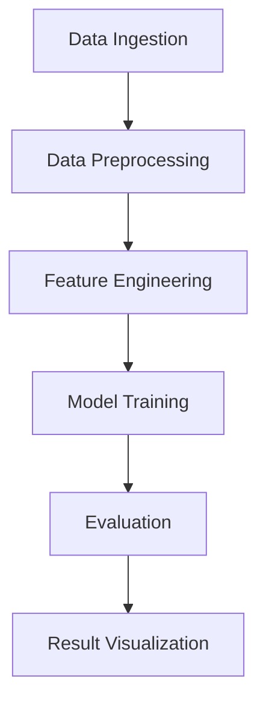

## Tech Stack Used

Matplotlib, NumPy, Pandas

---

## Architecture Diagram

---

## Project Architecture and Workflow

1. **Data Ingestion**: Data is loaded using pandas and relevant preprocessing is done.
2. **Preprocessing**: Missing values, outliers, and noise are handled.
3. **Feature Engineering**: Transformation and selection of relevant features.
4. **Model Training**: Machine learning models are trained using scikit-learn.
5. **Evaluation**: Models are evaluated using accuracy, confusion matrix, etc.
6. **Visualization**: Data and results are visualized using matplotlib/seaborn.

---

## Additional Documentation

All relevant logic and output are included in the notebook: `khushalsubmission.ipynb`
